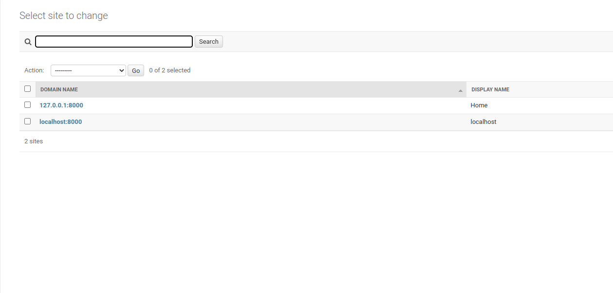
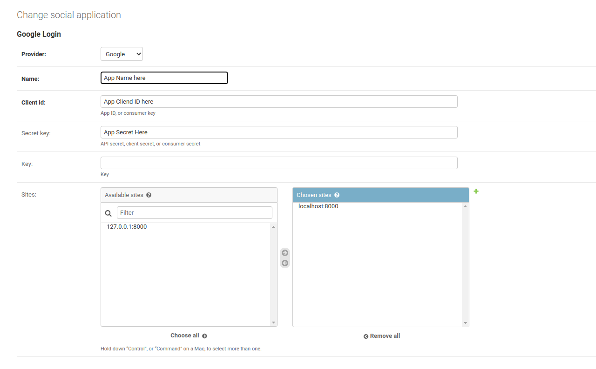

Django Elearning Platform
=============================

## Get Secret Key
* Get a secret key from [Djecrety Website](https://www.djecrety.ir) and connect it with secret_key in settings.py

 

## Setup
* Create and install the requirements.txt

 

## In Admin panel
#### Do this in the Django admin interface
 

* Add your domain names to sites in the admin panel Eg. `127.0.0.1:8000` or `localhost:8000` or `yourdomain.com` and give them a name

 
 

* Get the app client ID and secret key and it to the Social application

 
 

